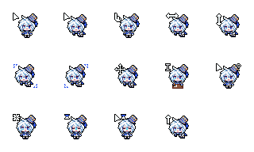

# Furina Cursor

These cute animations were originally created by [@Snooa_o](https://x.com/Snooa_o), you may go to <https://ko-fi.com/s/68b8bb9b08> to download a copy. <del>I wrote a script to convert the `.ani` files to CSS animations</del> There is something wrong with my code, so forget about it, but I managed to get the correct CSS file. You only need to apply these classes to your elements:

| Class Name                  | Cursor Type |
| --------------------------- | ----------- |
| `cursor-furina-default`     | default     |
| `cursor-furina-default-2`   | default     |
| `cursor-furina-pointer`     | pointer     |
| `cursor-furina-ew-resize`   | ew-resize   |
| `cursor-furina-ns-resize`   | ns-resize   |
| `cursor-furina-nwse-resize` | nwse-resize |
| `cursor-furina-nesw-resize` | nesw-resize |
| `cursor-furina-move`        | move        |
| `cursor-furina-text`        | text        |
| `cursor-furina-help`        | help        |
| `cursor-furina-not-allowed` | not-allowed |
| `cursor-furina-wait`        | wait        |
| `cursor-furina-progress`    | progress    |
| `cursor-furina-alias`       | alias       |

Have fun.
